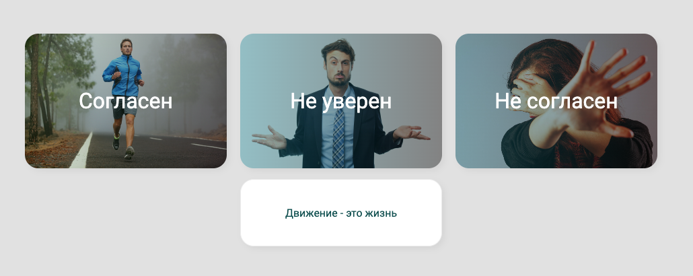
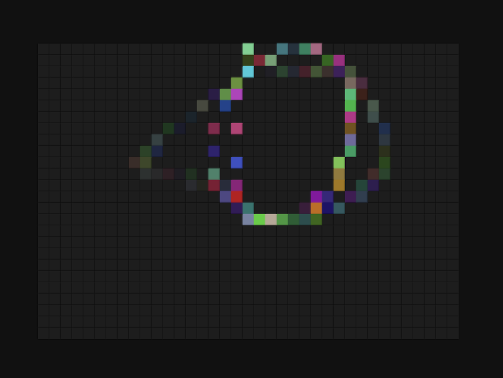
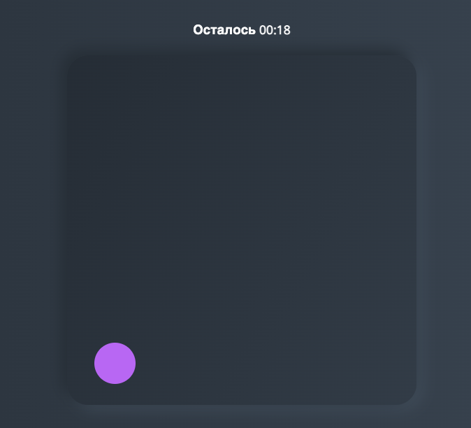

# Marathon 5 JS projects

Марафон на практическое применение JS

## Цель: 

Изучить новые приемы использования JS и закрепить на практике

## Использованныe технологии:
* HTML
* CSS
* JS

## День 1. Создан красивый и необычный слайдер на чистом JS:
[Ссылка на проект:](https://codepen.io/VladimirAlbrekht/pen/qBLNpBe)
 

## День 2. Создан модуль с возможностью перетаскивания элемента в разные разделы:
[Ссылка на проект:](https://codepen.io/VladimirAlbrekht/pen/YzdWMjN)
 

## День 3. Создан альтернативный вариант слайдера в связке css анимация + JS:
[Ссылка на проект:](https://codepen.io/VladimirAlbrekht/pen/dywpOdZ)
 

## День 4. Создана доска для рисования CSS + JS c функцией генерации случайных цветов:
[Ссылка на проект:](https://codepen.io/VladimirAlbrekht/pen/BavLdwZ)
 

## День 5. Создана игра для улучшения точности на трех экранах:
[Ссылка на проект:](https://codepen.io/VladimirAlbrekht/pen/qBLqKKq)
В течение отведенного времени, которое выбирает игрок, в разных местах на доске появляется кружки разного размера и цвета. При нажатии на один круг, он исчезает и появляется новый круг в другом месте доски. После завершения раунда, игрок видит свой результат.
|  |  |  |

